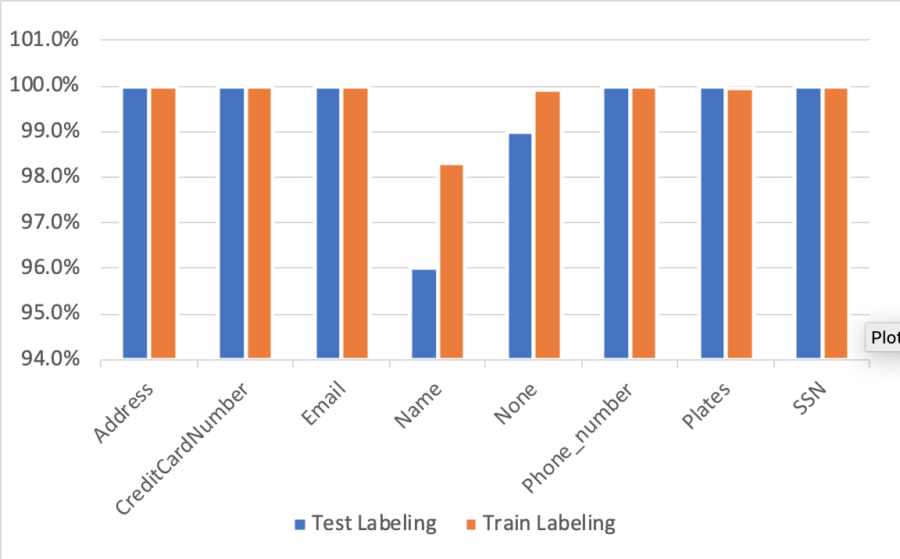
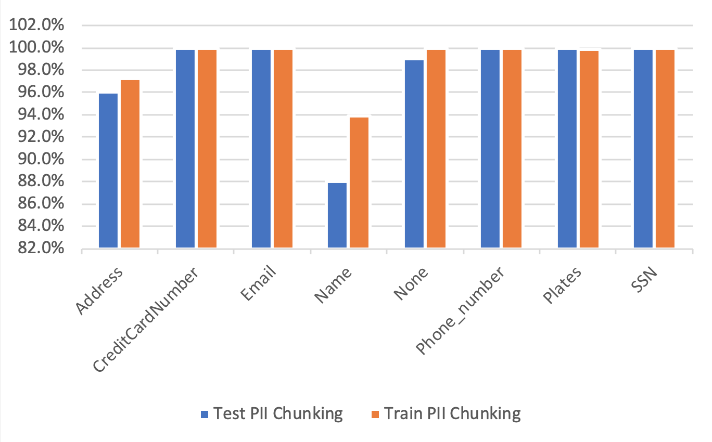

# PII Detector

This application reads in a .csv file and identifies, classifies and chunks the following Personally Identifiable information (PII):

1.	Address
2.	Credit Card
3.	Phone Number
4.	Name
5.	Email
6.	License Plate
7.	SSN
8.	None

This program utilizes three trained ML-classifiers that can be loaded from ./saved_models/:

1.	Bi-directional multi-layer Gated Recurrent Unit (GRU) address-name classifier (classifier.pt)
2.	Naive Bayes Address chunker (address_chunker.pickle) 
3.	Naive Bayes Name chunker (name_chunker.pickle)

All classifiers are trained on PIITrain15K.csv and evaluated on PIITrainLargeData.csv. To test the performance of this algorithm, run main.py. This code will update your_file_name.csv test data with the type of PII and the PII chunk. To train the model LOAD_MODEL = True. This takes about 30 min on my GTX 1080Ti GPU.

## How it works?

For each sentence, first the sentence is classified based on the PII. The classifier then runs the sentence through a pipeline of RegEx matchers to find Emails, SSNs, Credit Cards, Phone Numbers. If none of these are found in the sentence, then a bi-directional multi-layer GRU classifies whether a sentence includes an Address, a Name or neither. Based on the results of this classification one of the following four things can happen:

1.	If an Address is found, the Naive Bayes Address chunker finds the address. 
2.	If GRU does not find an address, then RegEx is used to find Plates. 
3.	If a Name is found, the Naïve Bayes Name chunker finds the name.
4.	If GRU does not find a Name, then the sentence is marked as None

## Performance

The performance of this algorithm was evaluated on PIITrain15K.csv and PIITrainLargeData.csv. The models are trained on PIITrain15K.csv. Hereafter, PIITrain15K.csv and PIITrainLargeData.csv are referred to as train and test data, respectively. 

The chart below shows the results of the classification: 

Almost all sentences are classified correctly. The algorithm performs slightly better on the train dataset than on the test dataset. This behavior is expected as that dataset was used for training the model parameters. The Name and None classification have the lowest performances compared to the other classes, with Name being 96% (98%) and None being 99% (100%) accurate for test(train) datasets. 

The chart bellow shows the performance of the PII chunking. A chunk was defined accurate if it fully matches the gold standard. As anticipated, the train performance outperforms the that of the test. The results here are very promising. The SSN, Plates, Phone Numbers, Emails, are chunked 100% accurately. We observe a 1% error in None which is carried over from the classification. Address is chunked more accurately compared to Name, partially because the Address classification was more accurate. The Name chunking has the lowest performance among all classes. Name is chunked with 88% accuracy whereas, Address is chunked with 96% accuracy on the unseen test data. On the train data, Name is chunked 94% accurately and Address is chunked 97% accurately. 

The details of these calculations can be found in ./data/AllDataReport.xlsx file.

